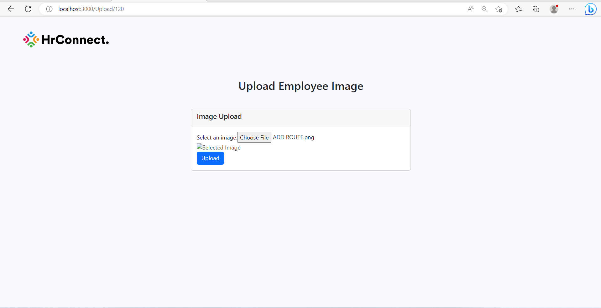
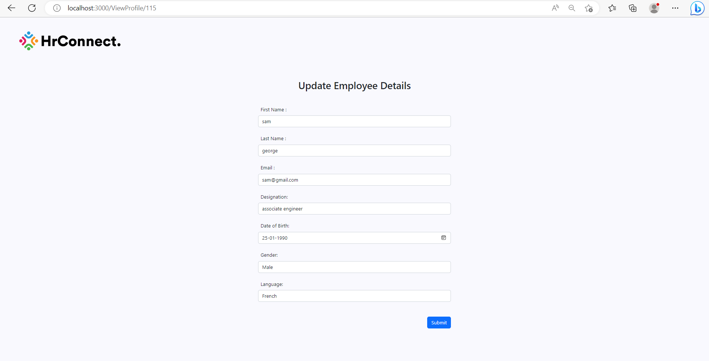
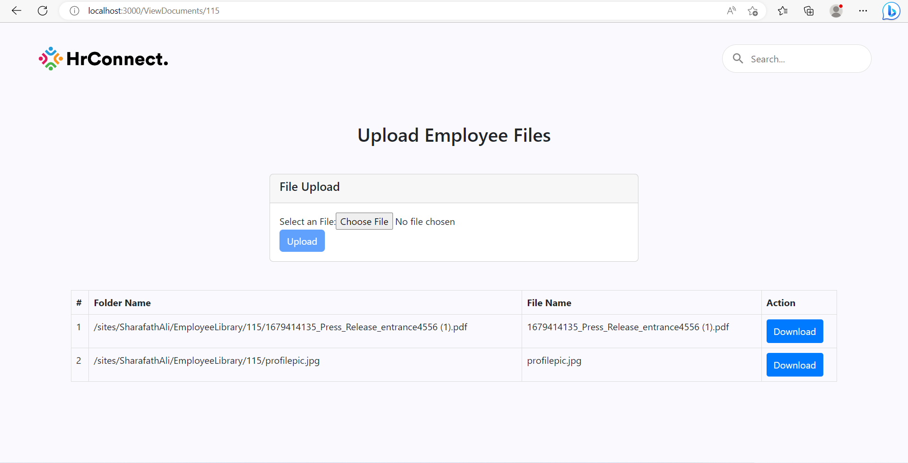

# Employment Management Site

This is a web-based application for managing employees in a company. The application is built using React, Node, and SharePoint list with TypeScript.

## Features

- **Home Page**: Displays the main landing page of the application with a visually appealing image or content to welcome users.

  
  
- **Add Employee Page**: Allows users to add new employees to the system. The page includes a form for inputting employee information such as name, contact details, and job details.

  
  

- **Upload Page**: Provides functionality for uploading documents related to employees, such as resumes, contracts, or other relevant files.

  


  

- **Profile View**: Displays the profile details of an employee, including their personal information, job details, and uploaded documents.

  
  

- **Update**: Allows users to edit and update the details of an existing employee, such as their contact information or job details.

  
  
  
## Technologies Used

- React: A popular JavaScript library for building user interfaces.

- Node: A JavaScript runtime environment that allows for server-side development.

- SharePoint: A web-based collaborative platform used for document management and content management.

- TypeScript: A superset of JavaScript that adds static types to the language, providing improved code quality and maintainability.

## Installation

1. Clone the repository to your local machine.

2. Install dependencies for both the frontend and backend by running the following commands in their respective directories:

```sh
cd server
npm install

```
3. Configure the SharePoint list connection in the server by providing the necessary credentials and connection details in the server configuration file.

4. Start the development server for both the frontend and backend by running the following commands in their respective directories:

```sh
cd client
npm start
```

```sh
cd server
npm start
```

5. Access the application in your web browser at http://localhost:3000 to begin using the employment management site.
Contributing
If you would like to contribute to this project, feel free to submit a pull request or open an issue with your suggestions or bug reports. Contributions are always welcome!

License
This project is licensed under the MIT License.

Make sure to replace the image file paths with the correct paths to your actual images in your project.
